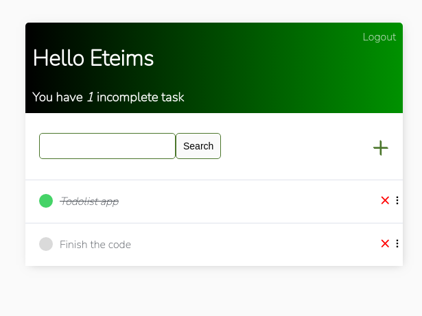
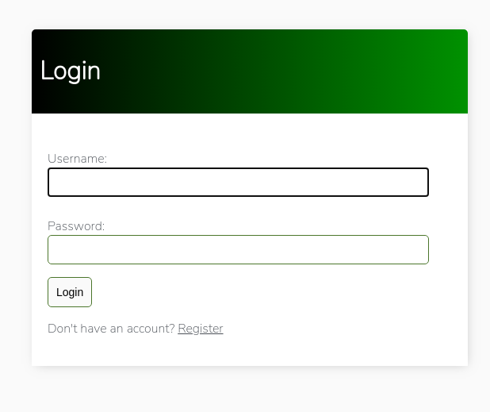

# Django Todo list with authentication.

A To-do list app with User Authentication built with django.

## Task list page

## Login Page

## Todo

- [ ] Make the todo list dragable with sortable.js
- [x] Fix IDOR vulnerability.

## Resources

[Tutorial by Dennis Ivanov](https://github.com/divanov11/Django-To-Do-list-with-user-authentication)

[Fix for IDOR Vulnerability](https://github.com/divanov11/Django-To-Do-list-with-user-authentication/issues/5)
